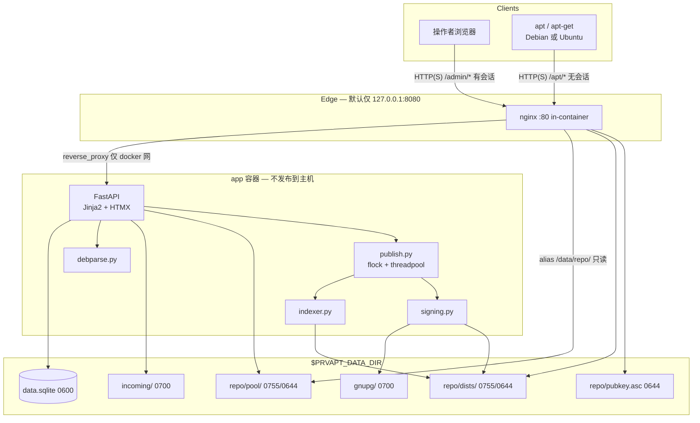
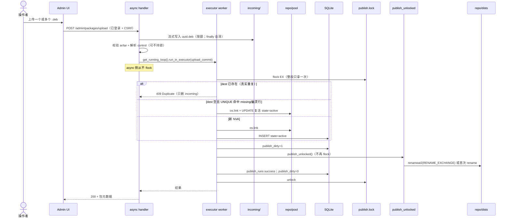

# PrvAptMirror 设计文档

| 字段 | 内容 |
| --- | --- |
| 产品 | PrvAptMirror — 个人 Debian/Ubuntu `.deb` 托管与 apt 源 |
| 作者 | TBD |
| 日期 | 2026-08-19 |
| 状态 | Draft（rev 3 + 落地变更：应用自己暴露端口，**不再内置 nginx**；反代/TLS 交给宿主机） |
| 仓库 | `/root/workspace/PrvAptMirror`（greenfield，无既有代码） |
| 受众 | 单机自托管的个人运维者；文档读者为熟悉 Linux / apt 的工程师 |

> **落地变更（2026-08-20）**：仓库不再内置 nginx。进程同时提供 `/admin/` 与 `/apt/`，Compose 只映射应用端口；TLS / 域名 / 访问控制交给宿主机反代。下文里 in-compose nginx、sibling `alias`、`nginx/nginx.conf` 视为已废弃。

---

## Overview

个人电脑和服务器上经常需要安装**没有官方 apt 源**的 `.deb`：自编译工具、厂商只提供单文件下载的软件、需要冻结的旧版本、内网脚本打出来的包。现在的做法通常是 `dpkg -i`、随手搭一个 `dpkg-scanpackages` 目录，或打开 `trusted=yes` 的临时源。这些做法不可复现、不可签名、升级与回滚都痛苦。

PrvAptMirror 是一个跑在单台 VPS / 家用 NAS / Tailscale 节点上的**个人 apt 仓库**。操作者用密码登录后台，上传 / 下载 / 删除 `.deb`；系统把包放入 **binary-name** `pool/` 布局，原子地生成并 **GPG 签名** `Packages` / `Release` / `InRelease`。Debian 与 Ubuntu 客户端按官方第三方源方式加入一条 `deb822` 源后，即可 `apt update && apt install <pkg>`。设计按「一个操作者、几十到几百个包、几十 GB 磁盘」的真实规模取舍，不按 SaaS 多租户做。

---

## Background & Motivation

### 当前状态

工作区为空，无既有架构、无历史包袱。需要从零定义：

- 正确的 Debian archive 布局与元数据（这是唯一真正难的部分）；
- 足够安全的单人后台；
- 一个人能维护数年的部署形态。

### 痛点

1. **没有源**：只有散落的 `.deb`，无法用 `apt upgrade` 跟踪更新，也无法用 `apt install pkg=version` 回滚。
2. **手写索引易错**：漏签 `InRelease`、`Architecture: all` 没并进 `binary-amd64`、半写入的 `Packages` 会让所有客户端 `apt update` 失败。
3. **`trusted=yes` 是常见捷径**：关闭 apt 的签名校验，局域网里已经危险，暴露到公网不可接受。
4. **reprepro / aptly 本身不是产品**：它们能生成正确仓库，但不提供「密码登录、上传、删除确认、复制粘贴客户端配置」这条个人工作流。

### 规模假设（按此设计，不要按百万用户扩）

| 量 | 假设 | 含义 |
| --- | --- | --- |
| 操作者 | 1 人（允许日后加第 2 个 admin 账号，但不做 IAM） | 无租户、无 RBAC、无 SSO |
| 包数量 | 20–300 个 `.deb`，峰值 < 1000 | 全量重建索引可接受 |
| 单包大小 | 常见 1–80 MB；上限默认 512 MB | Chrome / 自编译 CUDA 工具等 |
| 仓库体积 | 数 GB 到约 50–100 GB | 文件系统即可，不上对象存储 |
| 并发 | 1 个后台会话 + 若干台 `apt update` | 单进程 uvicorn 足够 |
| 客户端 | 自己的 Debian / Ubuntu 机器 | 同一份源，不按发行版拆套件 |

---

## Goals & Non-Goals

### Goals

1. 托管任意合法 `.deb`（含 `control.tar.zst`），从 control 提取元数据并纳入 apt 源。
2. 后台：密码登录、包列表（搜索/筛选）、单文件与多文件上传、下载、删除确认、仓库状态与客户端接入片段。
3. 对外提供 Debian archive 兼容 HTTP 树：`pool/` + `dists/<suite>/<component>/binary-<arch>/`。
4. 生成 `Packages`、`Packages.gz`、`Release`、`InRelease`，以及兼容旧 apt 的 `Release.gpg`。
5. 默认 **GPG 签名**；客户端用 `Signed-By` 绑钥。**不以 `trusted=yes` 为默认接入方式。**
6. 发布必须原子：失败或并发时，客户端不能读到半截索引，也**不能**读到短暂消失的 `dists/`。
7. 一个人用 Docker Compose（或等价的 nginx + systemd）能在单机上跑数年；备份/恢复路径明确。

### Non-Goals（v1 明确不做）

- 多租户 SaaS、组织/团队、OAuth/OIDC、细粒度 ACL。
- 官方 Debian/Ubuntu 镜像（mirror）、snapshot.debian.org 风格历史快照服务。
- 从源码构建 `.deb`、CI 出包、webhook 自动摄入。
- `deb-src` / `Sources`、`Contents-*`（apt-file）、i18n `Translation-*`、PDiffs。
- 按发行版拆 `bookworm` / `jammy` 多 suite（数据模型预留，UI/发布器 v1 只做一个 suite）。
- Flatpak / Snap / RPM。
- 高可用、多副本、自动水平扩展。
- 对上传包做杀毒或供应链扫描（信任模型见 Security）。
- 应用商店式评分、文档站、公开浏览目录。**`autoindex off` 不是访问控制**：未认证的 `/apt/` 仍通过 `Packages` 暴露完整目录，等价于公开这批软件。
- UI 里生成 apt HTTP Basic、`Valid-Until` 开关、自动裁旧版本、用户管理、TOTP、内置 ACME（见 Deferred）。

---

## Key Decisions

| # | 决策 | 选择 | 理由 |
| --- | --- | --- | --- |
| K1 | 索引器 | **自研 Python 索引器**（`python-debian` + `zstandard` 解析 + 按 [DebianRepository/Format](https://wiki.debian.org/DebianRepository/Format) 写文件），**不用 reprepro/aptly 做运行时依赖** | 个人规模全量重建 < 5s；避免双写漂移；集成测试用官方 `apt` 经 **nginx** 锁正确性 |
| K2 | 默认仓库模型 | 单一 suite=`stable`，codename=`stable`，component=`main`，arch=`amd64,arm64,all` | 这是第三方个人源，不是 Debian 镜像；Debian 与 Ubuntu 客户端共用同一 URI |
| K3 | 签名 | 首次启动生成 **RSA 4096** 仓库密钥（按指纹选用）；发布 `InRelease` + `Release` + `Release.gpg` | 兼容性最好的无聊选择；不默认 `trusted=yes` |
| K4 | 重复包 | `Package + Version + Architecture` **拒绝**（`active`/`pending_delete` 且 dest 仍在）；pool 用 `os.link` **独占创建**。`state=missing`（或 dest 已空的幽灵行）再传同一 NVA 则 **复活**，不是 409 | Linux `rename` 会覆盖 dest；`missing` 行仍占 UNIQUE，不能当普通冲突删新 blob |
| K5 | 历史版本 | **全部保留**，直到操作者显式删除 | 个人仓库的核心价值之一是 `apt install pkg=oldver` |
| K6 | 栈 | **Python 3.12 + FastAPI + Jinja2 + HTMX + SQLite**；HTMX 源码 vendored | 无 Node 构建链；`python-debian` 解析 control；一个人可调试 |
| K7 | UI | **服务端渲染**，HTMX 做局部刷新；Jinja2 **autoescape 开启** | 个人运维后台不值得养 SPA |
| K8 | 静态源 | **生产 nginx 用 sibling `alias` 只映射 `repo/`**（bind 整个 data 目录，**禁止**把 alias 指到数据根）；应用只写盘与后台 | apt 热路径不经 Python；避免 named-volume subpath；避免把 `gnupg/` 暴露到 HTTP |
| K9 | 部署 | 默认 **Docker Compose**（app + nginx），**主机端口绑定 `127.0.0.1:8080`**；不发布 app `:8000` | 单 VPS 可复现；默认不把后台暴露到 `0.0.0.0:80` |
| K10 | Apt 鉴权 | 默认 **`/apt/` 无认证**（= 公开软件目录）；可选 nginx HTTP Basic；`/admin` 注释掉的 `allow`/`deny` | Tailscale / 局域网 / 已 HTTPS 域名；Basic 作公网加固；`autoindex off` 不保密 |
| K11 | 存储 | **本地文件系统** + SQLite；不上 S3 | 该规模对象存储只会增加恢复复杂度 |
| K12 | 进程模型 | **单 worker**。`fcntl.flock` **只**在 executor 线程里拿一次：`publish()` = `with lock: publish_unlocked()`。上传/删除/启动各是一个同步函数，内部拿锁、改 DB、调 `publish_unlocked()`、成功再 unlink。`async def` **禁止**持锁。用 `asyncio.get_running_loop().run_in_executor` | Linux `flock` 对两个 FD **不递归**；事件循环上持锁再 `run_in_executor(publish)` 会死锁并堵住 `/healthz` |
| K13 | 变更顺序 | **先 `publish_unlocked()` 再生效删除**：pool 对象只在本轮 `publish_runs.status=success` 之后 `unlink`。删除与发布共享同一次加锁 | 否则旧 `Packages` 指向已删 blob；二次 `flock` 会死锁 |
| K14 | 写路由 | **任何 mutating `/admin` 路由都要求已登录**；`PRVAPT_INSECURE_NO_AUTH=1` 仅当 `PUBLIC_URL` 为 loopback 才允许启动 | 防止 `main` 在认证合入前变成未认证上传面 |

---

## Proposed Design

### 系统架构



**认证边界**：cookie `Path=/admin`；nginx 把 `/apt/` 当静态只读树（只映射 `repo/`）。apt 客户端即使被骗访问 `/admin` 也带不上可用会话（SameSite + Path）。**未认证的 `/apt/` 能列出并下载所有包**（经 `Packages`），这是默认产品行为，不是疏漏。

### 仓库布局（磁盘即协议）

`$PRVAPT_DATA_DIR` 建议 `/var/lib/prvaptmirror`：

```
/var/lib/prvaptmirror/
├── data.sqlite                  # 0600
├── data.sqlite-wal
├── publish.lock
├── admin-bootstrap.txt          # 仅首次；0600；改密后删除
├── gnupg/                       # GNUPGHOME，0700，uid=app；nginx 不得 alias 到此
│   └── ...
├── incoming/                    # 0700；上传临时文件
├── staging/                     # 索引生成工作区，发布后删
└── repo/                        # 0755；nginx 只读映射此树 = 客户端 URI 根
    ├── pubkey.asc               # 0644 ASCII-armored 公钥
    ├── keyring.gpg              # 0644 dearmored
    ├── pool/                    # 0755 / 文件 0644
    │   └── main/
    │       ├── f/foo/foo_1.2-1_amd64.deb
    │       ├── f/foo/foo_1:2.0-1_amd64.deb    # epoch 冒号原样留在文件名
    │       └── libb/libbar/libbar_2.0-1_all.deb
    └── dists/                   # 真实目录，或 RENAME_EXCHANGE 后的那棵树
        └── stable/
            ├── InRelease
            ├── Release
            ├── Release.gpg
            └── main/
                ├── binary-amd64/
                │   ├── Packages
                │   ├── Packages.gz
                │   └── Release          # 必生成，并列入 suite Release 哈希表
                ├── binary-arm64/
                │   └── ...
                └── binary-all/
                    └── ...
```

**权限（app 启动时强制）**：

| 路径 | mode |
| --- | --- |
| `gnupg/` | `0700` |
| `incoming/` | `0700` |
| `data.sqlite*` | `0600` |
| `repo/` 及子目录 | `0755` |
| `repo/` 下普通文件 | `0644` |
| `admin-bootstrap.txt` | `0600` |

app 进程 umask `022`，uid/gid 例如 `1000:1000`，与 nginx 读取 `repo/` 兼容（world-readable 文件 + 非 world-readable 密钥）。

**Pool 路径规则（binary-name pool；apt 兼容，不是 dak 同源布局）**：

官方 dak/reprepro 的 pool 是 `pool/<component>/<source-prefix>/<source>/`。本仓库 **没有 `.dsc` / `deb-src`**，按 **binary 包名** 分目录。apt 只使用 `Packages` 里的 `Filename:`，不在意 pool 分层，因此这对个人源是对的。日后若加 source 包，不要假设现有路径等于 dak。

```python
def pool_prefix(name: str) -> str:
    if name.startswith("lib") and len(name) >= 4:
        return name[:4]          # libbar → libb
    return name[0]               # foo → f

# pool/main/<prefix>/<name>/<name>_<ver>_<arch>.deb
```

**规范文件名（epoch 三重约定，必须同时遵守）**：

| 层 | 规则 |
| --- | --- |
| 磁盘文件名 | `{Package}_{Version}_{Architecture}.deb`，Version **原样包含 epoch 冒号** `:`。例：`foo_1:2.0-1_amd64.deb`。**不**把 `:` 写成 `%3a` 字节。`+`、`~` 也不编码。 |
| `Filename:` 字段 | 相对 URI 根、与磁盘路径字节一致。例：`pool/main/f/foo/foo_1:2.0-1_amd64.deb` |
| HTTP | apt 会把 `:` 写成 `%3a` 去请求。nginx 对 URI **解码后再查文件**，于是找到带冒号的 inode。PR 12 必须经 **nginx** 安装带 epoch 的包，不能只走 Starlette StaticFiles。 |

**永远不要用用户上传的原始文件名拼 pool 路径。**

客户端请求：`GET {URIs}/pool/main/f/foo/foo_1.2-1_amd64.deb`。

### Suite / Component / 多发行版

个人源不是 Debian 或 Ubuntu 的派生发行版。客户端写：

```
Suites: stable
Components: main
```

即可，**与本机是 bookworm 还是 noble 无关**。依赖能否满足由包自己的 `Depends` 决定：一个只链了 Ubuntu 24.04 `libc` 符号的包，在 Debian 上 `apt` 会拒绝安装——这是正确行为，不要靠拆 suite 伪装。

配置项允许把 suite 名改成 `prv` / `sid` 等，但 v1 UI 不提供「多 suite 上传」。`packages` 表预留 `component` 列，默认 `main`。

Architectures 默认 `amd64 arm64 all`。遇到 control `Architecture` 不在允许列表中的包（例如 `i386`、`armhf`）：**拒绝上传并提示**如何把该 arch 加入配置后全量重发布。不要悄悄丢进错误的 `binary-*`。

**已经入库、后来被移出 `PRVAPT_ARCHS` 的行**：`publish()` **不得 raise**。跳过这些行、不写入任何 `binary-*`，仪表盘列出「因当前 arch 配置而未发布」的包。把该 arch 加回配置并点「重建索引」即可复活。文件与 DB 行保持不动。

### `Architecture: all` 的映射（容易做错）

官方 archive 行为（也是 apt 的假设）：

| 索引路径 | 收录 |
| --- | --- |
| `dists/stable/main/binary-amd64/Packages` | `Architecture: amd64` **以及** `Architecture: all` |
| `dists/stable/main/binary-arm64/Packages` | `arm64` **以及** `all` |
| `dists/stable/main/binary-all/Packages` | **仅** `all` |

stanza 里的 `Architecture:` 字段保持 control 原值（`all` 包在 `binary-amd64/Packages` 里仍写 `Architecture: all`）。客户端 `apt update` 只拉 `binary-$(dpkg --print-architecture)/Packages`。如果 `all` 包只写在 `binary-all/` 而不并进 `binary-amd64/`，amd64 机器会看不到这个包。

`Release` 的 `Architectures:` 字段必须列出配置里的全部 arch（默认 `amd64 arm64 all`）。即使当前没有 `all` 包，也生成**空的** `binary-all/Packages`（零字节）以及对应 `.gz` 和 per-arch `Release`。不要用缺失文件代替空索引。

### 索引内容规格

#### Packages 条目

从 `.deb` 的 control 段按**白名单、固定顺序**复制字段，并**覆盖/追加**仓库字段。序列化代码按下面的列表 emit，**不要** `for k, v in control_json.items()`（JSON round-trip 会打乱顺序、破坏 Description 续行）。`control_json` 只供后台只读展示。

**白名单与顺序**（字段缺失则整行省略，不写空值）：

1. `Package`
2. `Version`
3. `Architecture`
4. `Maintainer`
5. `Installed-Size`
6. `Depends`
7. `Pre-Depends`
8. `Recommends`
9. `Suggests`
10. `Conflicts`
11. `Breaks`
12. `Replaces`
13. `Provides`
14. `Enhances`
15. `Section`
16. `Priority`
17. `Homepage`
18. `Description`（含续行）
19. `Multi-Arch`
20. `Built-Using`
21. `Source`
22. `Filename`  ← 仓库写入
23. `Size`    ← 仓库写入
24. `MD5sum`  ← 仓库写入（注意 Packages 字段名是 `MD5sum`，Release 段落名是 `MD5Sum`）
25. `SHA1`
26. `SHA256`

**故意不复制 `Essential`**：第三方源里的 `Essential: yes` 会让客户端把该包装成系统 Essential，卸载保护被抬到危险级别。若 control 含 `Essential`，解析时记一条 warning，索引与 `control_json` 展示都**丢弃**该字段。

**由仓库写入，忽略 control 里可能存在的同名项**：

| 字段 | 来源 |
| --- | --- |
| `Filename` | pool 相对路径（可含 `:`） |
| `Size` | 文件字节数（十进制，无填充） |
| `MD5sum` | 文件 MD5，小写 hex |
| `SHA1` | 文件 SHA1，小写 hex |
| `SHA256` | 文件 SHA256，小写 hex |

MD5/SHA1 在 2026 年已不用于安全决策，但官方 `Packages` 仍带它们；为最大兼容三者都写。apt 校验安装时以 `SHA256` 为准。

编码：UTF-8，LF 行尾，无 BOM。Description 空行折成续行 ` .`（Debian policy §5.6.13）。stanza 之间一个空行（`\n\n`）。多版本按 `(name, debian.debian_support.Version, arch)` 排序（Version 用 Debian 比较，**不要**用裸字符串）。

**空 `Packages`**：精确为零字节文件 `b""`（不是 `"\n"`）。对应 `Packages.gz` = 对 `b""` 做下面的稳定 gzip。两种选择的哈希不同，金样与实现必须同一选择。

完整 stanza 示例（含多行 Description；`all` 包并进 `binary-amd64` 时 **Architecture 仍为 `all`**）：

```
Package: hello-prv
Version: 1.0-1
Architecture: all
Maintainer: Operator <ops@example.net>
Installed-Size: 12
Depends: libc6 (>= 2.34)
Section: utils
Priority: optional
Homepage: https://example.net/hello-prv
Description: example arch-all package
 This is the extended description.
 .
 Second paragraph.
Filename: pool/main/h/hello-prv/hello-prv_1.0-1_all.deb
Size: 1234
MD5sum: 0123456789abcdef0123456789abcdef
SHA1: 0123456789abcdef0123456789abcdef01234567
SHA256: 0123456789abcdef0123456789abcdef0123456789abcdef0123456789abcdef
```

`Packages.gz`：

```python
buf = io.BytesIO()
with gzip.GzipFile(filename="", mode="wb", fileobj=buf, mtime=0) as gz:
    gz.write(packages_bytes)
```

`filename=""` 且 `mtime=0`，避免把 staging 路径写进 gzip header 导致金样 flaky。

每个 `binary-<arch>/Release` **必写**（列入 suite `Release` 哈希表，这样金样稳定）：

```
Archive: stable
Origin: PrvAptMirror
Label: prvapt
Acquire-By-Hash: no
Component: main
Architecture: amd64
```

字段顺序即上；末尾一个 `\n`。

#### Release / InRelease

空仓库（无任何 `.deb`）的 `dists/stable/Release` 结构如下。哈希值由 PR 5 金样对真实字节计算；实现不得增删列出的路径。**per-arch `Release` 必须出现在哈希表中。**

```
Origin: PrvAptMirror
Label: prvapt
Suite: stable
Codename: stable
Date: Wed, 19 Aug 2026 12:00:00 UTC
Architectures: amd64 arm64 all
Components: main
Description: Personal apt repository
Acquire-By-Hash: no
MD5Sum:
 <md5>                0 main/binary-all/Packages
 <md5>               <n> main/binary-all/Packages.gz
 <md5>              <r> main/binary-all/Release
 <md5>                0 main/binary-amd64/Packages
 <md5>               <n> main/binary-amd64/Packages.gz
 <md5>              <r> main/binary-amd64/Release
 <md5>                0 main/binary-arm64/Packages
 <md5>               <n> main/binary-arm64/Packages.gz
 <md5>              <r> main/binary-arm64/Release
SHA1:
 ...同一组路径...
SHA256:
 ...同一组路径...
```

规则：

- 头部字段顺序固定为：`Origin`, `Label`, `Suite`, `Codename`, `Date`, `Architectures`, `Components`, `Description`, `Acquire-By-Hash`，然后 `MD5Sum` / `SHA1` / `SHA256`。
- `Date` 用 RFC 5322，UTC，**生产环境每次成功发布都写成「现在」**（包括手动重建、启动修复）。因此生产里「什么都没改也点发布」**会**改变 `InRelease`，客户端会重下。金样测试必须 freeze 时钟（例如 `Date: Wed, 19 Aug 2026 12:00:00 UTC`）。v1 **不做**「除 Date 外哈希不变则跳过签名」的优化。
- 哈希列表路径相对于 `dists/<suite>/`，**不要**带 `dists/stable/` 前缀。
- 每一行：一个空格 + hex + 一个空格 + **右对齐到 16 列**的十进制 size + 一个空格 + 相对路径。空 `Packages` 的 size 为 `0`。
- 哈希表路径按字典序（`main/binary-all/...` 先于 `main/binary-amd64/...`）。
- **不设置 `Valid-Until`**（v1 固定关）。
- **不做 by-hash 索引**（`Acquire-By-Hash: no`）。原子性靠 `RENAME_EXCHANGE`，不靠 by-hash。
- 不生成 `Contents-*`、`Translation-*`。客户端 404 这些是正常的。

`InRelease`：对 **与 `Release` 字节完全相同** 的内容做 OpenPGP **clearsign**。签名前不得改写行尾、不得给空 `Packages` 补 `\n`。现代 apt 只拉 `InRelease`；仍同时写 `Release` + `Release.gpg`（detached）给旧客户端。

### 索引器实现要点

模块：`prvaptmirror/indexer.py`、`prvaptmirror/publish.py`。

```python
def rebuild_dists(packages: list[PackageRow], staging_suite: Path, cfg: Config) -> list[PackageRow]:
    """返回因 arch 不在配置中而被跳过的行，供仪表盘；绝不 raise。"""
    skipped: list[PackageRow] = []
    by_arch: dict[str, list[PackageRow]] = {a: [] for a in cfg.architectures}
    for p in packages:
        if p.state != "active":
            continue
        if p.architecture == "all":
            if "all" in by_arch:
                by_arch["all"].append(p)
            for a in cfg.architectures:
                if a != "all":
                    by_arch[a].append(p)
        elif p.architecture in by_arch:
            by_arch[p.architecture].append(p)
        else:
            skipped.append(p)

    for arch, rows in by_arch.items():
        d = staging_suite / cfg.component / f"binary-{arch}"
        d.mkdir(parents=True)
        body = render_packages(rows)          # 固定字段序；空列表 → b""
        write_atomic(d / "Packages", body)
        write_gzip_stable(d / "Packages.gz", body)
        write_atomic(d / "Release", render_arch_release(cfg, arch))

    rel = render_release(cfg, staging_suite)  # 扫描并哈希上述全部文件
    write_atomic(staging_suite / "Release", rel)
    return skipped
```

金样覆盖：空仓库；`all` 包出现在 `binary-amd64/Packages` 且 `Architecture: all`；freeze 的 `Date`；gzip 不含 staging 路径。

### 原子发布



#### Pool 独占创建（K4）

**禁止** `os.rename(incoming, canonical)` 作为冲突检测：Linux 上它会覆盖已有 dest。

上传大文件在锁外写入 `incoming/<uuid>.deb`。**加锁只发生在 executor 里的 `upload_commit()`**（见下方锁协议），其内：

```python
dest.parent.mkdir(parents=True, exist_ok=True)
try:
    os.link(incoming_path, dest)          # dest 已存在 → EEXIST，不覆盖
except FileExistsError:
    incoming_path.unlink(missing_ok=True)
    raise DuplicatePackage(...)           # 409：真实重复（active / pending_delete 且文件还在）
st = dest.stat()
try:
    db.execute("INSERT INTO packages ...")
except IntegrityError:
    row = db.fetch_by_nva(...)
    # link 成功说明 dest 当时不存在：现有行是幽灵（missing，或 dest 已空的 pending_delete/active）
    if row is not None:
        db.execute(
            "UPDATE packages SET sha256=?, ... control_json=?, state='active' WHERE id=?",
            ...
        )                                 # 复活：保留新 blob，不 unlink
    else:
        if dest.stat().st_ino == st.st_ino:
            dest.unlink()
        raise DuplicatePackage(...)
incoming_path.unlink(missing_ok=True)     # dest 仍有一条 link
```

- **`os.link` → EEXIST**：磁盘上已有该 NVA 文件 → 409。仪表盘对 `pending_delete` 提示「先等删除完成或取消」。
- **`os.link` 成功 + INSERT UNIQUE**：磁盘空、行还在 → **复活**（`UPDATE` 校验和 / `control_json` / `state='active'`），**不得**按 `st_ino` 删刚链上的新文件。仪表盘对 `missing` 行显示「重新上传以修复」。
- `active` 且 dest 仍在走第一条；`missing` 走第二条。PR 4 单测必须覆盖「`missing` 行 + 再传同一 NVA → 成功且文件留下」。

`incoming/` 与 `pool/` 同在 `$PRVAPT_DATA_DIR`，同一文件系统，`link(2)` 合法。不要 `rename` 到规范名。

多文件上传：每个文件依次独占入 pool + INSERT/复活（同一把锁），全部完成后 **一次** `publish_unlocked()`。单文件失败不影响已成功入 pool 的兄弟文件；发布仍把成功的那些编进索引。

#### dists 交换（K13 配套，Goal 6）

两步 `mv dists → dists.old` 再 `mv dists.next → dists` 会在中间让 `repo/dists` **不存在**，并发 `apt update` 得到 `InRelease` 404。也不允许在交换前 `rm -rf dists.old`（那是唯一回滚副本）。

**指定调用**（Linux，本产品的 Docker 目标）。**必须**钉死 `argtypes` / `restype`：ctypes 默认把未声明参数当 C `int`，在 x86_64 上 64-bit 指针与 flags 会被截断，`flags=0` 退化成普通 `rename`——第二次发布 dest 已存在时失败，Goal 6 直接破。

```python
import ctypes, ctypes.util, errno, os

AT_FDCWD = -100
RENAME_EXCHANGE = 2  # linux/fs.h

_libc = ctypes.CDLL(ctypes.util.find_library("c"), use_errno=True)
_libc.renameat2.restype = ctypes.c_int
_libc.renameat2.argtypes = [
    ctypes.c_int, ctypes.c_char_p,
    ctypes.c_int, ctypes.c_char_p,
    ctypes.c_uint,
]

def rename_exchange(a: str, b: str) -> None:
    rc = _libc.renameat2(
        AT_FDCWD, a.encode("utf-8"),
        AT_FDCWD, b.encode("utf-8"),
        RENAME_EXCHANGE,
    )
    if rc != 0:
        err = ctypes.get_errno()
        if err == errno.ENOSYS:
            raise OSError(err, "renameat2(RENAME_EXCHANGE) unsupported; refusing two-step mv", a, None, b)
        raise OSError(err, os.strerror(err), a, None, b)
```

`ENOSYS` / 符号缺失：**立刻失败**，打明确错误，**禁止**回退到两步 `mv`（那会让 `dists/` 消失）。本产品目标就是 Linux Docker。

完整步骤（全部在**已经持有**的 `publish.lock` 内，由 `publish_unlocked()` 执行；写完后 `fsync` 文件与父目录）：

```
1. 在 staging/<uuid>/dists/<suite>/ 写完整新树（含 InRelease），fsync。
2. rm -rf repo/dists.next && mv staging/<uuid>/dists repo/dists.next
   （dists.next 此时不是 live 名，客户端不可见）
3. if repo/dists 不存在:  os.rename(repo/dists.next, repo/dists)   # 首次发布
   else:                 rename_exchange(repo/dists.next, repo/dists)
        # 交换后: dists = 新树，dists.next = 旧树
4. 仅当 live 名已指向新树: rm -rf repo/dists.next staging/<uuid>
```

客户端看到的路径 `repo/dists` 始终存在（首次发布前 `/readyz` 为 503，客户端本就不该加源）。nginx 已打开的 fd 继续指向旧 inode 直到该请求结束。

PR 7 必须断言：**第二次** publish 之后 `repo/dists` 的 inode 等于交换前 `dists.next` 的 inode；并发 `apt-get update` 不得 404 `InRelease`。

#### 锁协议（K12，禁止递归 flock）

Linux `flock(2)` 按 **打开的文件描述符** 计，同一进程两个 `open` + `LOCK_EX` **会死锁**。因此全项目只允许一种形状：

```python
@contextmanager
def publish_lock():
    """仅从同步代码调用。禁止在 async def / 事件循环线程里进入。"""
    fd = os.open(lock_path, os.O_RDWR | os.O_CREAT, 0o600)
    try:
        fcntl.flock(fd, fcntl.LOCK_EX)
        yield
    finally:
        fcntl.flock(fd, fcntl.LOCK_UN)
        os.close(fd)

def publish_unlocked() -> PublishResult:
    """假定锁已持有：重建索引、签名、gpgv、交换 dists、写 publish_runs。不再 open lock 文件。"""
    ...

def publish() -> PublishResult:
    """给「只想重建、不再改包表」的入口（手动 /admin/publish）。"""
    with publish_lock():
        return publish_unlocked()

def upload_commit(...) -> PublishResult:
    with publish_lock():          # 整段一次
        exclusive_link_or_revive(...)
        set_dirty()
        return publish_unlocked()

def delete_commit(package_id) -> PublishResult:
    with publish_lock():          # 整段一次
        mark_pending_delete(package_id)
        set_dirty()
        result = publish_unlocked()
        if result.ok:
            unlink_blob_and_delete_row(package_id)
            clear_dirty()
        return result

def startup_reconcile() -> None:
    with publish_lock():          # 整段一次
        quarantine_missing_blobs()
        finish_orphaned_pending_deletes_if_index_clean()
        if dists_missing or dirty or last_run_not_success:
            publish_unlocked()
```

FastAPI 路由：

```python
async def upload_route(...):
    # 只在锁外做流式落盘 + 解析
    loop = asyncio.get_running_loop()          # 不要 get_event_loop()
    return await loop.run_in_executor(None, upload_commit, ...)
```

**硬性规则**：

1. `async def` **不得** `flock`。不得在事件循环线程拿锁后再 `run_in_executor(publish)`——既死锁，又堵住 `/healthz`。
2. `publish_unlocked()` 假定锁已持有，内部不得再 `open` lock 文件。
3. `/healthz` 不取锁。
4. 写入 `incoming/` 与 control 解析在锁外；独占 `link` + DB 变异 + 索引交换在锁内。

PR 7 单测：线程 A 持锁睡眠，线程 B 调 `delete_commit`；A 释放后 B **必须结束**（今天这种「外层 flock 再调 `publish()`」会永远卡住）。

**崩溃恢复**（`startup_reconcile()`，**一次** `publish_lock`）：

| 现场 | 动作 |
| --- | --- |
| `dists` 存在，`dists.next` 存在 | live 可能是交换前（next=新）或交换后（next=旧）。比较两棵树的 `InRelease` mtime 不可靠。**以 `publish_runs` 为准**：若最后一次不是 `success`，丢弃 `dists.next`，保留 `dists`，再走下面的 dirty 重建。若最后一次已 `success`，`dists.next` 是待删旧树，删掉即可。 |
| 仅 `dists.next` | 视为未切流的完整或半完整新树：删掉 `dists.next`，按 dirty/缺失重建。 |
| `dists` 缺失 | 在本把锁内 `publish_unlocked()`（写到 `dists.next` 再 rename）。 |
| `settings.publish_dirty=1` 或最后 `publish_runs` 不是 `success` | 同一次加锁内 `publish_unlocked()`，即使 `dists` 看起来还在。**不要**再调会二次 `flock` 的 `publish()`。 |
| `packages.state=active` 但 pool 文件缺失 | 将该行改为 `state=missing`，**不**编进索引，仪表盘警告「重新上传以修复」；不得用幽灵行生成 `Filename`。 |
| `state=pending_delete` 且 dists 已不引用该 `Filename`（最近一次 success） | `unlink` blob，`DELETE` 行。 |

**失败**：签名失败、`gpgv` 失败、磁盘不足 → 不交换、`publish_runs=failed`、`publish_dirty` 保持 1、**pool 与 DB 保持可变之前的一致快照**（新上传的行+文件还在，只是 dists 尚未包含它们——仪表盘「索引落后于 DB」，启动会重试 `publish_unlocked`）。**不得**在 publish 失败时 unlink 刚入的 pool 文件（否则 DB 行变幽灵）；也不得在 publish 失败时 DELETE 待删行。

### 删除协议（K13）

HTTP 层只做 CSRF + 确认包名，然后 `await get_running_loop().run_in_executor(None, delete_commit, id)`。`delete_commit` 即上一节的同步函数（一次加锁 → `pending_delete` → `publish_unlocked()` → 成功才 unlink）。

若 `publish_unlocked` 失败：blob 仍在、DB 仍是 `pending_delete`、旧 dists 仍引用该文件 → 客户端一切如故。启动发现 dirty / failed 会在 `startup_reconcile` 里重试。**禁止**「先 DELETE 行 / 先 unlink 再发布」。**禁止**「持锁再调用会自己 `flock` 的 `publish()`」。

### `.deb` 解析与校验

模块：`prvaptmirror/debparse.py`。

运行时依赖：`python-debian`、**`zstandard`**（PyPI；Python 3.12 `tarfile` 无 zstd，没有它 `DebFile` 打不开 Ubuntu 21.10+ 常见的 `control.tar.zst`）。镜像里的 `dpkg` 可作为排障后备（`dpkg-deb -f`），默认路径仍走 `DebFile`，以便单测不 shell out。

**只读 control，不解开 `data.tar*` 到磁盘，不执行 maintainer script**（无论 gz/xz/zst）。

校验顺序：

1. 扩展名必须是 `.deb`（大小写不敏感）。Content-Type 允许 `application/vnd.debian.binary-package`、`application/x-debian-package`、`application/octet-stream`。
2. 文件是 Unix `ar`：成员至少包含 `debian-binary`、`control.tar*`（`.tar` / `.tar.gz` / `.tar.xz` / `.tar.zst`）、`data.tar*`。
3. `debian-binary` 内容以 `2.` 开头（2.0 格式）。
4. 用 `DebFile` 读 control；若因缺少 zstd 支持失败，返回明确错误「无法解压 control.tar.zst（内部错误，应安装 zstandard）」，不要泛化成「不是 deb」。
5. control 必填：`Package`、`Version`、`Architecture`。
6. `Package` 匹配 `^[a-z0-9][a-z0-9+.-]+$`。
7. `Architecture` ∈ 配置允许集合（上传时拒绝；已入库则发布时跳过，见上）。
8. `Version` 能被 `debian.debian_support.Version` 解析。
9. 拒绝 control 或**派生路径**中的 `..`、`/`、NUL。Version 中单独允许 `:`（epoch）。
10. 丢弃 `Essential`（warning）。
11. 计算整个 `.deb` 的 MD5/SHA1/SHA256 与 `Size`。

恶意/损坏包：解析失败 → `finally` 删除 incoming 文件 → 400，附人类可读原因。

PR 3 夹具至少包括：最小 `amd64`、`all`、**带 epoch `1:2.0-1`**、**`control.tar.zst`**、缺 control 的损坏 ar、非 ar 文件。

**信任模型**：操作者上传的包 = 操作者要分发给自己机器的软件。平台不做病毒扫描。结构校验保护索引器自己。

### GPG 密钥管理

首次启动 `signing.ensure_key()`：

- `GNUPGHOME=$PRVAPT_DATA_DIR/gnupg`，`0700`，属主与 app 进程相同。
- 列出密钥：`gpg --homedir ... --batch --list-secret-keys --with-colons`。
  - 0 把：生成一把。
  - 1 把：用它，指纹写入 `settings.gpg_fingerprint`。
  - \>1 把且未配置 `PRVAPT_GPG_FINGERPRINT`：启动失败（避免签错钥）。
- 生成 argv（无口令默认）：

```
gpg --homedir $GNUPGHOME --batch --yes --pinentry-mode loopback \
    --passphrase '' \
    --quick-generate-key "$PRVAPT_GPG_UID" rsa4096 sign never
```

- 有 `PRVAPT_GPG_PASSPHRASE_FILE` 时把 `--passphrase ''` 换成 `--passphrase-file $FILE`（文件 0600，不进环境、不进日志）。
- **默认无口令**。自动化发布必须非交互。保护靠文件权限、备份加密、主机只绑 loopback / Tailscale。
- 导出 `repo/pubkey.asc` 与 `repo/keyring.gpg`。指纹写入 `settings` 并显示在后台。
- Docker 第一次在全新 VM 上 `getrandom(2)` 可能短阻塞；若 keygen > 30s 打 warning。v1 不装 `haveged`。
- 不提供 v1 在线轮换 UI。轮换：停机、备份旧 `gnupg/`、删 keyring、重启、客户端重装 `Signed-By`。

**每次 publish 签名 argv**（`$FPR` = `settings.gpg_fingerprint`，必须带上，禁止「keyring 里随便哪一把」）：

```
gpg --homedir $GNUPGHOME --batch --yes --pinentry-mode loopback \
    --digest-algo SHA256 --default-key $FPR \
    --clearsign --output InRelease Release

gpg --homedir $GNUPGHOME --batch --yes --pinentry-mode loopback \
    --digest-algo SHA256 --default-key $FPR \
    --detach-sign --armor --output Release.gpg Release
```

随后：

```
gpgv --keyring $DATA_DIR/repo/keyring.gpg InRelease
```

失败则本轮 publish 失败、不交换。有口令时同样加 `--passphrase-file`。

不要把私钥放进镜像、git、SQLite。Compose 只 bind-mount 数据目录。

RSA 4096 而不是 ed25519：Ubuntu 18.04 / 老 `gpgv` 对 ed25519 仓库钥仍有坑。若确定最低客户端 ≥ Debian 11 / Ubuntu 20.04，可在配置切 `ed25519`。

### 应用栈与目录

```
PrvAptMirror/
├── README.md
├── LICENSE                     # 建议 MIT
├── pyproject.toml
├── Dockerfile                  # python:3.12-slim-bookworm + gnupg + sqlite3
├── docker-compose.yml
├── .env.example
├── nginx/nginx.conf            # 完整主配置：http { map ...; server { ... } }，挂载到 /etc/nginx/nginx.conf
├── prvaptmirror/
│   ├── main.py
│   ├── config.py
│   ├── db.py
│   ├── models.py
│   ├── auth.py
│   ├── csrf.py
│   ├── ratelimit.py
│   ├── debparse.py
│   ├── storage.py
│   ├── indexer.py
│   ├── signing.py
│   ├── publish.py
│   ├── snippets.py
│   ├── routes/admin.py
│   ├── routes/health.py
│   ├── templates/              # Jinja2 autoescape=True
│   └── static/htmx.min.js      # vendored，文件头注释版本号
├── scripts/backup.sh
├── scripts/restore.sh
└── tests/
    ├── fixtures/               # amd64 / all / epoch / control.tar.zst / corrupt
    ├── test_debparse.py
    ├── test_indexer.py
    ├── test_publish_atomic.py
    └── integration/test_apt_client.sh
```

Python 依赖：`fastapi`、`uvicorn[standard]`、`jinja2`、`python-multipart`、`python-debian`、**`zstandard`**、`argon2-cffi`。系统包：`gnupg`、`sqlite3`（给 `backup.sh` 的 `.backup`）、`gpgv`（通常随 gnupg）。

**单 worker**：`uvicorn ... --host 0.0.0.0 --port 8000 --workers 1`（容器内；**不要** publish 到主机）。限流以 SQLite `login_attempts` 为准，重启不丢失。

**incoming GC**：每次请求 `try/finally` 删掉自己的 `incoming/<uuid>.deb`；启动时删除 `incoming/` 下 mtime > 24h 的残留。

### 后台页面与交互

全部中文 UI，技术专有名词保留英文。control 字段进模板时走 autoescape，禁止 `|safe`。

| 路由 | 说明 |
| --- | --- |
| `GET/POST /admin/login` | 用户名+密码；用户不存在时仍跑一次 dummy argon2；失败文案统一 |
| `POST /admin/logout` | 删 session |
| `GET /admin/` | 仪表盘：包数量、各 arch、跳过的 arch、`pending_delete`、`missing`（「重新上传以修复」）、磁盘、上次发布、dirty、密钥指纹 |
| `GET /admin/setup` | 客户端片段 |
| `GET /admin/packages` | 搜索 / 筛 arch |
| `GET /admin/packages/{id}` | control 只读、校验和、下载、删除 |
| `POST /admin/packages/upload` | multipart；**需登录**；最多 **20 个文件**；整请求合计 ≤ `PRVAPT_MAX_UPLOAD_MB` |
| `GET /admin/packages/{id}/download` | 认证后 `Content-Disposition` |
| `POST /admin/packages/{id}/delete` | CSRF + 确认包名；走 pending_delete 协议 |
| `GET/POST /admin/password` | 改密；bootstrap 强制跳转；改密后删该用户全部 session |
| `POST /admin/publish` | 手动重建 |
| `GET /admin/static/*` | vendored 静态资源 |

上传约束：

- `PRVAPT_MAX_UPLOAD_MB` 默认 512。nginx `client_max_body_size 512m` 与之相同。多文件是「许多小包一次提交」，**不是** 20×512 MB；超大包请一次传一个。
- `Content-Length` 与实际写入双重限额；超限删 incoming。
- 上传前 `statvfs`：可用字节 < 本请求大小 + 1 GB → 507。发布前同样检查（索引很小，主要防 pool 盘满）。

### 客户端接入片段

`snippets.py` 用 `PRVAPT_PUBLIC_URL`（apt 源 origin，例如 `https://apt.example.net`）渲染，与 `PRVAPT_ADMIN_ORIGINS`（打开后台的 origin 列表）分离。URI 根是 `{PUBLIC_URL}/apt`。

**推荐（Debian 12+ / Ubuntu 22.04+，deb822）**：

```bash
sudo install -d -m 0755 /etc/apt/keyrings
sudo curl -fsSL https://apt.example.net/apt/pubkey.asc \
  -o /etc/apt/keyrings/prvaptmirror.asc
sudo tee /etc/apt/sources.list.d/prvaptmirror.sources >/dev/null <<'EOF'
Types: deb
URIs: https://apt.example.net/apt
Suites: stable
Components: main
Signed-By: /etc/apt/keyrings/prvaptmirror.asc
EOF
sudo apt update
```

现代 apt 可直接把 ASCII-armored 公钥用作 `Signed-By`。较旧系统：`gpg --dearmor` 到 `/etc/apt/keyrings/prvaptmirror.gpg`。

**传统 one-line**：

```
deb [signed-by=/etc/apt/keyrings/prvaptmirror.gpg] https://apt.example.net/apt stable main
```

**禁止在默认片段里出现**：`apt-key add`、`trusted=yes`、`/etc/apt/trusted.gpg.d/`。

若开启了 apt HTTP Basic，额外给出 `/etc/apt/auth.conf.d/prvaptmirror.conf`（0600）。

### 量化目标

| 操作 | 目标 |
| --- | --- |
| 解析 + 校验 50 MB `.deb` | < 300 ms（不含上传网络） |
| 全量重建 200 个包的 dists + 签名 | < 5 s（冷页缓存，单核） |
| 发布锁持有时间 | 独占 link + INSERT + 重建 + 交换；大文件落 incoming 不占锁 |
| `apt update` 元数据 | 通常 < 50 KB；局域网 < 200 ms |
| 后台列表（≤ 1000 行） | < 100 ms 生成 HTML |
| 进程 RSS | 通常 < 150 MB |
| 磁盘：SQLite + 索引 | < 20 MB |
| 磁盘：数据卷建议 | 包总大小 × 1.2 + 5 GB 余量 |

生产每次 publish 都会因 `Date` 变化而更新 `InRelease`；量化里的「重建」包含签名。金样不把生产 Date 稳定性当作不变量。

---

## API / Interface Changes

Greenfield，无 before/after。对外契约如下。

### 环境变量

| 变量 | 默认 | 含义 |
| --- | --- | --- |
| `PRVAPT_DATA_DIR` | `/var/lib/prvaptmirror` | 唯一可变状态根 |
| `PRVAPT_SECRET_KEY` | （必填，生产） | cookie 签名无关（session id 是随机 token）；仍用于 CSRF 备用；≥ 32 字节随机 |
| `PRVAPT_ADMIN_USER` | `admin` | 引导用户名 |
| `PRVAPT_ADMIN_PASSWORD` | 空 | 若空则生成并写入 `admin-bootstrap.txt` |
| `PRVAPT_PUBLIC_URL` | `http://127.0.0.1:8080` | **apt 片段** origin，不要尾斜杠 |
| `PRVAPT_ADMIN_ORIGINS` | `http://127.0.0.1:8080,http://localhost:8080` | CSRF 允许的 `Origin` / `Referer` 列表；Tailscale 用法：加上 `http://100.x.x.x:8080` |
| `PRVAPT_COOKIE_SECURE` | `auto` | `auto`：若受信任跳的 `X-Forwarded-Proto=https` 则 Secure；`true`/`false` 强制 |
| `PRVAPT_TRUSTED_PROXY_CIDRS` | `172.16.0.0/12,127.0.0.1/32,10.0.0.0/8` | 仅当 **对端 socket IP** 落在这些网段时才信 `X-Real-IP`。无全局 boolean。v1 不读 `CF-Connecting-IP` |
| `PRVAPT_INSECURE_NO_AUTH` | 未设置 | 仅测试。`=1` 且 `PUBLIC_URL` host 为 loopback 才启动；否则拒绝 |
| `PRVAPT_MAX_UPLOAD_MB` | `512` | 单请求上限；亦是单文件上限 |
| `PRVAPT_MAX_UPLOAD_FILES` | `20` | 单次 multipart 文件数上限 |
| `PRVAPT_SUITE` | `stable` | |
| `PRVAPT_CODENAME` | `stable` | |
| `PRVAPT_COMPONENT` | `main` | |
| `PRVAPT_ARCHS` | `amd64,arm64,all` | 发布时未知 arch **跳过**而非崩溃 |
| `PRVAPT_ORIGIN` | `PrvAptMirror` | |
| `PRVAPT_LABEL` | `prvapt` | |
| `PRVAPT_GPG_UID` | `PrvAptMirror <apt@localhost>` | |
| `PRVAPT_GPG_FINGERPRINT` | 空 | 多把密钥时必填 |
| `PRVAPT_GPG_PASSPHRASE_FILE` | 空 | |
| `PRVAPT_SESSION_DAYS` | `7` | 滑动续期上限 |

### HTTP 面

| 前缀 | 认证 | 实现 |
| --- | --- | --- |
| `/admin/*` | session（或 INSECURE 且 loopback） | 应用；含 `/admin/static/` |
| `/healthz` | 无 | 应用；DB 可打开即 200；不取 publish 锁 |
| `/readyz` | 无 | 密钥存在且 live `InRelease` 存在；首次未发布 503 |
| `/apt/*` | 默认无；可选 Basic | **仅 nginx**。集成测试禁止走 Starlette StaticFiles |

无公开 JSON API。不存在未认证的写路由（除非 INSECURE 测试开关）。

---

## Data Model Changes

SQLite 单文件，WAL。迁移：`db.py` 里有序 `migrations`，用 `user_version`。不做 Alembic。

```sql
PRAGMA journal_mode=WAL;
PRAGMA foreign_keys=ON;
PRAGMA busy_timeout=5000;

CREATE TABLE users (
  id            INTEGER PRIMARY KEY,
  username      TEXT NOT NULL UNIQUE COLLATE NOCASE,
  password_hash TEXT NOT NULL,
  must_change_password INTEGER NOT NULL DEFAULT 0,
  created_at    TEXT NOT NULL,
  last_login_at TEXT
);

CREATE TABLE sessions (
  id           TEXT PRIMARY KEY,          -- SHA-256(hex) of the cookie token
  user_id      INTEGER NOT NULL REFERENCES users(id) ON DELETE CASCADE,
  created_at   TEXT NOT NULL,
  expires_at   TEXT NOT NULL,
  last_seen_at TEXT NOT NULL,
  ip           TEXT,
  user_agent   TEXT
);

CREATE TABLE packages (
  id            INTEGER PRIMARY KEY,
  name          TEXT NOT NULL,
  version       TEXT NOT NULL,
  architecture  TEXT NOT NULL,
  component     TEXT NOT NULL DEFAULT 'main',
  filename      TEXT NOT NULL UNIQUE,     -- pool 相对 repo/，可含 ':'
  size          INTEGER NOT NULL,
  md5           TEXT NOT NULL,
  sha1          TEXT NOT NULL,
  sha256        TEXT NOT NULL,
  control_json  TEXT NOT NULL,            -- 供 UI；索引器不按此迭代
  state         TEXT NOT NULL DEFAULT 'active',  -- active|pending_delete|missing
  uploaded_at   TEXT NOT NULL,
  uploaded_by   INTEGER REFERENCES users(id),
  UNIQUE(name, version, architecture)
);

CREATE INDEX idx_packages_name ON packages(name);
CREATE INDEX idx_packages_state ON packages(state);

CREATE TABLE publish_runs (
  id            INTEGER PRIMARY KEY,
  started_at    TEXT NOT NULL,
  finished_at   TEXT,
  status        TEXT NOT NULL,            -- running|success|failed
  duration_ms   INTEGER,
  package_count INTEGER,
  error         TEXT
);

CREATE TABLE settings (
  key   TEXT PRIMARY KEY,
  value TEXT NOT NULL
  -- 已知键: publish_dirty ('0'|'1'), gpg_fingerprint
);

CREATE TABLE login_attempts (
  id       INTEGER PRIMARY KEY,
  ip       TEXT NOT NULL,
  username TEXT,
  success  INTEGER NOT NULL,
  at       TEXT NOT NULL
);

CREATE INDEX idx_login_ip_at ON login_attempts(ip, at);
```

限流权威：`login_attempts`（每 IP 15 分钟 5 次失败 → 锁 15 分钟）。不另做内存 limiter。

**DB vs 文件系统**：

| 数据 | 权威来源 | 可重建？ |
| --- | --- | --- |
| `.deb` blob | `repo/pool` | 否，必须备份 |
| 索引 dists | 由 pool+DB 派生 | 是，可丢 |
| 包元数据 | DB | v1 不自动 ingest 孤儿文件 |
| 签名私钥 | `gnupg/` | 否 |
| 管理员哈希 | DB | 可重新 bootstrap |
| session | DB 内存的是 **hash**；cookie 里才是 token | 可丢 |

### 备份 / 恢复

镜像安装 `sqlite3` CLI。`scripts/backup.sh` 在 **app 容器内**跑，或主机同样安装 sqlite3：

1. `sqlite3 data.sqlite ".backup $DEST/data.sqlite"`（热备，不停机）。
2. `tar --exclude=repo/dists -C $DATA_DIR -czf $DEST/pool-and-meta.tgz repo/pool gnupg`。
3. 清单：包数量、指纹、sha256 列表。
4. gnupg 备份应再套一层 age/gpg 口令。

`scripts/restore.sh`：

1. `docker compose stop`（或 `systemctl stop`）——**必须停 app 与 nginx**。
2. 解包到 `$PRVAPT_HOST_DATA`。
3. `sqlite3 data.sqlite "PRAGMA integrity_check"`。
4. `docker compose start`；启动若 dirty / 无 dists 则自动 `publish()`。

### 引导

1. 数据目录空 → 建目录并 chmod（见权限表）、生成密钥、导出公钥。
2. `users` 空 → 创建 `PRVAPT_ADMIN_USER`。密码：环境变量或 20 字符 `secrets.token_urlsafe`，写入 `$DATA_DIR/admin-bootstrap.txt`（0600）。生成密码时 `must_change_password=1`。日志只写路径。
3. 改密成功后删除 `admin-bootstrap.txt`。

v1 UI 不做用户管理。

---

## Alternatives Considered

### A. 索引器：自研 vs reprepro vs aptly

| | 自研（选定） | reprepro | aptly |
| --- | --- | --- | --- |
| apt 正确性 | 需金样 + 经 nginx 的真实 `apt` 集成测试 | 极高 | 高 |
| 与 Web 后台集成 | 一个 DB，一个发布函数 | 双状态机 | 另需守护进程 |
| 原子发布 | `renameat2(RENAME_EXCHANGE)` | 基本可靠 | snapshot 天生原子 |
| 运维依赖 | Python + gnupg + zstandard | reprepro + conf | aptly |
| 个人规模 | 全量重建可忽略 | 增量用不上 | 过重 |
| 风险 | 写错 `all` 合并或 Release 哈希 | 「包在 reprepro 里但不在 UI」 | 多一个会挂的守护进程 |

**为什么不选 reprepro**：做成带登录的个人托管平台时，CLI 对账成本高于约 200 行索引器。补偿：**PR 5 金样 + PR 12 经 nginx 用官方 apt**。

**为什么不选 aptly**：snapshot 对「传一个包立刻可见」过重。

**`apt-ftparchive`**：官方工具。v1 不用（钉死 Debian 全家桶、仍要自己按 arch 过滤）。若金样与真实 apt 出现无法解释的差异，再作为 v1.1 可选后端（Deferred）。

### B. 后台：SSR+HTMX vs SPA

SSR+HTMX：无 Node 构建链、表单+cookie 自然、HTMX vendored。SPA 不适合一个人维护五年的后台。

### C. `/apt/` 由 nginx 静态 vs 应用代发

选定生产 nginx sibling `alias`。开发可用应用代发同一 `repo/`，**但 PR 12 与生产验收必须打 nginx**。应用代发不能当作「生产 nginx 也行」的证据（StaticFiles 与 nginx 对 `%3a` 的处理不同）。

### D. 部署：Compose vs 纯 systemd

Compose 默认。附一份 `nginx.conf` + unit 给不想 Docker 的人。

### E. SQLite vs Postgres

个人单机 SQLite。该并发下 Postgres 零收益。

### F. dists 切换：symlink 替换 vs `RENAME_EXCHANGE`

symlink + `rename(2)` 覆盖指针也是原子的，且不用 ctypes。不选它作为默认：nginx/root 对 symlink 的 `disable_symlinks`、以及 `dists` 从真目录迁到 symlink 的首次升级，都比「`dists` 始终是目录、交换 inode」更绕。产品已锁定 Linux Docker，`renameat2` 可接受。`ENOSYS` 时失败，不回退两步 `mv`。

---

## Security & Privacy Considerations

### 威胁模型

部署假设两种：

1. **Tailscale / 局域网 only**（推荐）：攻击者需先进入该网络。默认 compose 绑 `127.0.0.1:8080`，再按需用 Tailscale serve / SSH 隧道 / 主机 Caddy。
2. **公网 DNS + HTTPS**：操作者**显式**把端口改成 `0.0.0.0:80` 或在前面加反代时才会出现。此时 `/apt/` 默认等于公开软件目录；`/admin` 必须有强密码。nginx 配置里为 `/admin` 准备了注释掉的 `allow`/`deny`。

| 威胁 | 严重度 | 缓解 |
| --- | --- | --- |
| 暴破后台密码 | 高 | argon2id；`login_attempts` 每 IP 15 分钟 5 次失败锁 15 分钟；dummy hash；默认不听公网 |
| 会话劫持 | 高 | `HttpOnly; SameSite=Lax; Path=/admin`；`Secure` 看 `PRVAPT_COOKIE_SECURE`/`X-Forwarded-Proto`；DB 只存 session token 的 SHA-256；改密删全部 session |
| CSRF | 高 | 同步器 token + `Origin`/`Referer` ∈ `PRVAPT_ADMIN_ORIGINS`（**不是**只对 `PUBLIC_URL`） |
| 未认证写入源 | 高 | 写路由必登录；INSECURE 开关拒绝非 loopback；nginx `/apt/` 仅 GET/HEAD；alias 只到 `repo/` |
| pool 路径穿越 | 高 | 路径只从已校验的 Package/Version/Arch 派生 |
| 半写入 / 缺失 dists | 高 | `renameat2(RENAME_EXCHANGE)`；先 publish 再 unlink |
| 并发同 NVA 覆盖后误删 | 高 | `os.link` EEXIST；UNIQUE 失败只按 `st_ino` 删自己 |
| 签名私钥被读 | 高 | `0700`；nginx 只读 `repo/`；不进镜像 |
| 公钥 HTTP MITM | 高 | 片段用 https PUBLIC_URL；仪表盘展示指纹 |
| HTTP apt + 仅 GPG | 中 | GPG 防篡改；不防流量分析与导钥 MITM |
| 限流 IP 变成 nginx 容器 IP | 高（未设计时） | 只从 `TRUSTED_PROXY_CIDRS` 对端读 `X-Real-IP`；外层 Cloudflare 不做 v1 |
| 磁盘满 | 中 | 上传/发布前 `statvfs` |
| XSS 经 Description | 中 | Jinja2 autoescape；永不 `\|safe` control 字段 |
| `Essential:` 投毒客户端 | 中 | 丢弃该字段 |
| 日志泄漏 | 中 | 不记密码、session token、Authorization |
| 依赖供应链 | 低 | 钉版本；vendored htmx |

### 认证细节

- 哈希：`argon2id`，`time_cost=3`，`memory_cost=65536`，`parallelism=2`。
- 用户不存在：对内置 dummy hash（启动时对丢弃的随机口令做一次哈希，或编译期常量）做 `verify`，避免时序泄露。
- Cookie `prvapt_session` = 32 字节 urlsafe token；SQLite `sessions.id` = `sha256(token).hexdigest()`。数据目录被读不能直接盗用 cookie。
- CSRF：POST 必须带 token；`Origin`（优先）或 `Referer` 的 origin 必须 ∈ `PRVAPT_ADMIN_ORIGINS`。缺两者 → 拒绝。`PUBLIC_URL` 只用于 apt 片段，不单独当 CSRF 白名单（后台常走 Tailscale IP / `.local`，与 apt 域名不同）。
- `Secure`：见 `PRVAPT_COOKIE_SECURE`。外层 Caddy 终止 TLS 时，compose nginx 必须把 `X-Forwarded-Proto` 往下传（有则用客户端带来的，否则 `$scheme`），**不要**只根据容器内 `$scheme=http` 或只根据 `PUBLIC_URL` 判断。
- 登录成功 `session.regenerate`。
- 对端 IP：若 `request.client.host ∈ PRVAPT_TRUSTED_PROXY_CIDRS`，用 `X-Real-IP`（由本 compose 的 nginx 设为 `$remote_addr`）；否则用 socket peer。再前面还有一层 Caddy/Cloudflare 时，所有操作者可能共享一个 IP，限流退化为**全局** 5 次 / 15 分钟——对单操作者可接受。v1 不解析 `CF-Connecting-IP`。

### 密钥与密钥以外的秘密

| 秘密 | 位置 |
| --- | --- |
| `PRVAPT_SECRET_KEY` | 环境 / Compose secrets |
| 管理员密码哈希 | SQLite |
| session token | 仅 cookie；DB 里是 SHA-256 |
| GPG 私钥 | `gnupg/` |
| GPG 口令（若有） | 独立 0600 文件 |
| apt Basic 密码 | 只存在 nginx `htpasswd` |

### 明确不默认做的事

- `trusted=yes`、`apt-key add`、`/etc/apt/trusted.gpg.d/`
- 主机 `0.0.0.0:80`、发布 app `:8000`
- HTML 内嵌私钥
- 把 `Essential` 写入 `Packages`

---

## Observability

### 日志

stderr 一行一条：`login_ok` / `login_fail` / `upload_ok` / `upload_reject` / `delete` / `publish_ok` / `publish_fail`。禁止记录密码、session token、Basic 头。

### 指标（仪表盘 + 日志）

`package_count`、`repo_bytes`、`disk_free_bytes`、`publish_duration_ms`、`publish_dirty`、`login_fail_total`。

### 故障模式

| 故障 | 检测 | 行为 |
| --- | --- | --- |
| 磁盘满 | `statvfs` | 上传/发布 507；旧 dists 保留 |
| 损坏 .deb | DebFile / zstd 异常 | 400，不入 pool |
| 密钥目录空/多把未指定 | 启动 + 发布前 | 拒绝发布 / 拒绝启动 |
| 并发同 NVA | `link` EEXIST | 409；不动已有 dest |
| `missing` 行再传同一 NVA | UNIQUE 且 dest 空 | 复活：UPDATE 为 active，保留新 blob |
| 进程在交换中被杀 | 启动按 `publish_runs` + dirty | 见崩溃恢复表；**不会**出现「无 dists」窗口给 live 客户端 |
| 删除后 publish 失败 | dirty + pending_delete | 旧索引与 blob 仍一致；启动重试 |
| `PRVAPT_ARCHS` 缩窄 | 发布跳过 | 仪表盘列出；不崩溃 |
| SQLite busy | `busy_timeout=5000` | 重试一次；仍失败 503 |
| incoming 残留 | 启动 mtime>24h | 删除 |

---

## Rollout Plan

### 部署默认形态

`docker-compose.yml`：

```yaml
services:
  app:
    build: .
    user: "1000:1000"
    expose: ["8000"]          # 不 ports 到主机
    environment:
      PRVAPT_TRUSTED_PROXY_CIDRS: "172.16.0.0/12,10.0.0.0/8,127.0.0.1/32"
      PRVAPT_PUBLIC_URL: "http://127.0.0.1:8080"
      PRVAPT_ADMIN_ORIGINS: "http://127.0.0.1:8080,http://localhost:8080"
    volumes:
      - ${PRVAPT_HOST_DATA:-./data}:/var/lib/prvaptmirror
    healthcheck:
      test: ["CMD", "python", "-c", "import urllib.request; urllib.request.urlopen('http://127.0.0.1:8000/healthz')"]
  nginx:
    image: nginx:1.26-alpine
    ports:
      - "127.0.0.1:8080:80"   # 不是 0.0.0.0:80
    depends_on:
      app:
        condition: service_healthy
    volumes:
      - ${PRVAPT_HOST_DATA:-./data}:/data:ro    # 整个 data，靠 alias 限制到 repo/
      - ./nginx/nginx.conf:/etc/nginx/nginx.conf:ro
```

**不要**只把 `server { }` 挂进镜像自带的 `conf.d/`：`map` 必须在 `http` 里，放进 `server` 或只作为注释会让 `$fwd_proto` 为空，`COOKIE_SECURE=auto` 在外层 TLS 下发不出 `Secure`。

首次：`mkdir -p data && chown 1000:1000 data`（避免 Docker 以 root 建目录导致 app 不能写）。app 启动再 `mkdir` 子目录并 chmod。**不要**用 named volume 的 `subpath` 只挂 `repo/`——不可移植，且第一次 nginx 启动会以 root 创建空 `repo/`。

TLS 由**上游** Caddy / Traefik / 主机 certbot 终止；本 compose 不内置 ACME。

仓库交付一份**完整、未注释、可直接替换**的 `nginx/nginx.conf`（alpine/官方镜像的主配置）：

```nginx
worker_processes auto;
error_log /var/log/nginx/error.log warn;
pid /tmp/nginx.pid;

events { worker_connections 1024; }

http {
    include       /etc/nginx/mime.types;
    default_type  application/octet-stream;
    sendfile      on;

    # 必须在 http 上下文且启用。空入站头时回落到 $scheme。
    map $http_x_forwarded_proto $fwd_proto {
        default $http_x_forwarded_proto;
        ""      $scheme;
    }

    server {
        listen 80;
        client_max_body_size 512m;

        # sibling alias，各自带尾斜杠；禁止 alias /data/;
        location /apt/pool/ {
            alias /data/repo/pool/;
            autoindex off;
            limit_except GET HEAD { deny all; }
            add_header Cache-Control "public, max-age=31536000, immutable" always;
        }
        location /apt/dists/ {
            alias /data/repo/dists/;
            autoindex off;
            limit_except GET HEAD { deny all; }
            add_header Cache-Control "public, max-age=60" always;
        }
        location /apt/ {
            alias /data/repo/;
            autoindex off;
            limit_except GET HEAD { deny all; }
            add_header Cache-Control "public, max-age=60" always;
        }

        location /admin {
            # 公网或仅 Tailscale 时取消注释：
            # allow 100.64.0.0/10;
            # allow 192.168.0.0/16;
            # deny all;
            proxy_pass http://app:8000;
            proxy_set_header Host $host;
            proxy_set_header X-Real-IP $remote_addr;
            proxy_set_header X-Forwarded-For $remote_addr;
            proxy_set_header X-Forwarded-Proto $fwd_proto;
        }
        location /healthz { proxy_pass http://app:8000/healthz; }
        location /readyz  { proxy_pass http://app:8000/readyz; }
    }
}
```

`/admin` **无**尾斜杠，以便 `/admin` 与 `/admin/`、`/admin/static/htmx.min.js` 都匹配。`pool/` 长缓存；`dists/` 60s。Cloudflare 必须对 `/apt/dists/*` 同样短缓存，否则 hash mismatch。

PR 10 验收：从受信任对端带 `X-Forwarded-Proto: https` 登录，响应 `Set-Cookie` **必须**含 `Secure`。不带该头、直接打 loopback HTTP 时不得误加 `Secure`（否则浏览器丢 cookie）。

### 功能开关

行为全靠环境变量。apt Basic 通过是否挂载 `htpasswd` 决定，不写进 Python。

### 回滚

换回上一镜像。SQLite 迁移只追加。dists 可重建。

### 发布给自己的检查清单

1. `curl -fsS http://127.0.0.1:8080/healthz`
2. 确认 `ss -lntp` 没有 `0.0.0.0:8000`
3. 登录后台，上传 `all`、`amd64`、带 epoch 的包
4. 经 **8080/nginx** 在 bookworm 容器：导钥 → deb822 → `apt update` → `apt install`
5. 删除一个包后再 `apt update`，该包消失且其余包仍可装
6. 指纹对照；`scripts/backup.sh` 含 `gnupg/private-keys-v1.d`

---

## Open Questions

v1 无阻塞未决项；PR 1 可以按本文开工。曾列在此处的产品开关均已有默认，见下一节。

---

## Deferred to v1.1

| 项 | v1 默认（已锁定） |
| --- | --- |
| apt Basic 的 UI 生成 htpasswd | 不做；只靠 nginx 配置 |
| `Valid-Until` 开关 | 关；不写该字段 |
| 每包最多保留 N 个版本 | 全保留，显式删除 |
| `apt-ftparchive` 可选后端 | 纯 Python 索引器 |
| 添加第二管理员的表单 | 表结构支持，无 UI |
| TOTP | 不做 |
| Compose 内置 Caddy/ACME | 不做；端口默认 loopback |
| 除 Date 外不变则跳过重签 | 每次成功发布都写新 Date 并签名 |
| 解析 `CF-Connecting-IP` | 不做 |

---

## Risks

| ID | 风险 | 严重度 | 缓解 |
| --- | --- | --- | --- |
| R1 | 自研索引器与官方 archive 有细微格式差 | 高 | PR 5 金样；PR 12 经 nginx 跑 bookworm + noble |
| R2 | 公网后台被暴破后投毒 | 高 | 默认 loopback；强哈希；限流；被盗后轮换密钥 |
| R3 | HTTP 下载 `pubkey.asc` MITM | 高 | https PUBLIC_URL；展示指纹 |
| R4 | 无口令 GPG 私钥随磁盘被盗 | 高 | 0700；nginx 看不到 gnupg；备份加密 |
| R5 | CDN 缓存 InRelease | 中 | 短 Cache-Control |
| R6 | 大包上传占用内存 | 中 | 流式落盘 |
| R7 | publish 堵住 event loop / 二次 flock 死锁 | 高 | `async def` 不持锁；`get_running_loop().run_in_executor`；只在 worker 内 `publish_lock` 一次再 `publish_unlocked` |
| R8 | Debian version 排序写错 | 中 | 只用 `debian.debian_support.Version`；测试 `~` `+` epoch |
| R9 | `renameat2` 在非 Linux 不可用或 ctypes 原型错误 | 中 | 钉死 `argtypes`/`restype`；`ENOSYS` 直接失败，禁止两步 `mv`；PR 7 断言第二次发布 inode 交换 |
| R10 | 外层反代后限流 IP 合并 | 低 | 单操作者下全局 5/15min 仍能挡暴破 |

---

## References

- Debian Wiki: [DebianRepository/Format](https://wiki.debian.org/DebianRepository/Format)
- Debian Wiki: [DebianRepository/UseThirdParty](https://wiki.debian.org/DebianRepository/UseThirdParty)
- `sources.list(5)`，Debian bookworm manpage
- `apt-secure(8)`
- Linux `renameat2(2)` / `RENAME_EXCHANGE`
- [Cloudflare: Don't use apt-key](https://blog.cloudflare.com/dont-use-apt-key/)
- `python-debian`：`debian.debfile.DebFile`、`debian.debian_support.Version`
- `zstandard`（给 `control.tar.zst`）
- 先前艺术：`reprepro`、`aptly`、`apt-ftparchive`、`freight`、`mini-dinstall`

---

## PR Plan

按依赖顺序、每个 PR 可独立审查并合并。合并后 `main` 应始终能 `docker compose up --build`。**认证（PR 8）必须在任何 mutating HTTP 路由进入 `main` 之前。** PR 4 只交库与单测，不注册写路由。磁盘预检在 PR 4，不放到 PR 11。

### PR 1 — 仓库骨架与可运行空服务

- **标题**：`chore: bootstrap FastAPI app, Docker Compose, and health endpoints`
- **影响**：`pyproject.toml`、`Dockerfile`（含 `gnupg` `sqlite3`）、`docker-compose.yml`（`127.0.0.1:8080`、app 不 publish）、`.env.example`、`prvaptmirror/main.py`、`config.py`、`routes/health.py`、`README.md`
- **依赖**：无
- **内容**：空应用；`GET /healthz`；环境变量读取；非 root；数据目录 mkdir/chmod。尚无写路由、无仓库。`PRVAPT_INSECURE_NO_AUTH` 已解析：非 loopback 拒绝启动。

### PR 2 — SQLite schema 与迁移框架

- **标题**：`feat: add SQLite schema, migrations, and settings store`
- **影响**：`db.py`、`models.py`、`tests/test_db.py`
- **依赖**：PR 1
- **内容**：`packages.state`、`publish_dirty`、hashed `sessions.id`、`login_attempts`。测试升级空库。

### PR 3 — `.deb` 解析与校验库

- **标题**：`feat: parse and validate .deb control metadata including zstd and epoch`
- **影响**：`debparse.py`、`tests/fixtures/*`、`test_debparse.py`、`pyproject.toml`（`zstandard`）
- **依赖**：PR 1
- **内容**：ar/tar 检查、zst control、epoch `:`、丢弃 `Essential`、损坏夹具。不写 pool。

### PR 8 — 密码登录、session、CSRF、限流、引导

- **标题**：`feat: admin authentication with argon2id sessions`
- **影响**：`auth.py`、`csrf.py`、`ratelimit.py`、`templates/login.html`、相关测试
- **依赖**：PR 2
- **内容**：bootstrap 文件；强制改密；cookie 标志；`ADMIN_ORIGINS` CSRF；CIDR 信任 `X-Real-IP`；DB 限流；dummy argon2；session id 哈希存储。**此 PR 之后才允许写路由。** 与 PR 3 并行。

### PR 4 — Pool 独占存储（无 HTTP 写路由）

- **标题**：`feat: exclusive pool placement with disk preflight`
- **影响**：`storage.py`、`tests/test_storage.py`
- **依赖**：PR 2、PR 3
- **内容**：`incoming/` 流式写入、size 限额、`statvfs`、`os.link` 独占。`link` EEXIST → 409；`link` 成功 + UNIQUE 且行是 `missing` / 幽灵 → **复活**（UPDATE `state=active`，保留新 blob），不得按 `st_ino` 删。incoming `finally` + 启动 GC。单测：并发同 NVA 409；**`missing` 行再传同一 NVA 成功**。**不**添加 `POST /admin/packages/upload`。

### PR 5 — Packages / Release 生成器（未签名）

- **标题**：`feat: generate Packages and Release indexes from pool+DB`
- **影响**：`indexer.py`、`tests/test_indexer.py`、金样
- **依赖**：PR 4
- **内容**：字段顺序金样；空 `Packages` = `b""`；gzip `mtime=0 filename=""`；freeze `Date`；`all` 并进 `binary-amd64` 且字段仍为 `all`；未知 arch 跳过；per-arch `Release` 进哈希表。不调用 gpg。

### PR 6 — GPG 引导与 InRelease / Release.gpg

- **标题**：`feat: bootstrap RSA-4096 repo key and sign InRelease`
- **影响**：`signing.py`、`tests/test_signing.py`
- **依赖**：PR 5
- **内容**：文档中的完整 argv；按指纹选钥；多把密钥失败；`gpgv` 校验；独立 `GNUPGHOME`。

### PR 7 — 原子 publish、删除协议、启动 reconcile

- **标题**：`feat: atomically publish dists with renameat2 and unlink-after-success`
- **影响**：`publish.py`、`tests/test_publish_atomic.py`
- **依赖**：PR 6
- **内容**：拆 `publish()` / `publish_unlocked()` / `upload_commit` / `delete_commit` / `startup_reconcile`。锁只在同步函数里拿一次；`async` 侧只用 `get_running_loop().run_in_executor`。ctypes `renameat2` 带 `argtypes`/`restype`；`ENOSYS` 失败、禁止两步 `mv`。断言第二次 publish 后 `dists` inode == 原 `dists.next` inode。单测：持锁线程阻塞时 `delete_commit` 不会自死锁，释放后结束。pending_delete 后 `publish_unlocked` 再 unlink；dirty；崩溃分步 kill -9。HTTP 仍等 PR 9。

### PR 9 — 完整 SSR 后台

- **标题**：`feat: HTMX admin UI for package lifecycle and client setup snippets`
- **影响**：`templates/*`、`static/htmx.min.js`、`routes/admin.py`、`snippets.py`
- **依赖**：PR 7、PR 8
- **内容**：中文界面；autoescape；vendored htmx；多文件（≤20）上传；删除确认；`PUBLIC_URL` 片段；无 `trusted=yes`。**第一条登录保护的写路由在此合入。**

### PR 10 — nginx 静态 `/apt/` 与生产 Compose

- **标题**：`feat: serve apt archive via nginx sibling aliases`
- **影响**：`nginx/nginx.conf`（完整主配置，**不是**只往 `conf.d/` 丢 server）、`docker-compose.yml`、README
- **依赖**：PR 7、PR 8（Cookie `Secure` 验收需要登录路径）
- **内容**：`http { map $http_x_forwarded_proto $fwd_proto { ... } }` **未注释**；三处 sibling `alias`；`/admin` 无尾斜杠；`/healthz` `/readyz`；`X-Real-IP`；`127.0.0.1:8080`；注释 `allow`/`deny`；`client_max_body_size 512m`。验收：受信任对端带 `X-Forwarded-Proto: https` 登录，`Set-Cookie` 含 `Secure`；裸 HTTP 不含。开发代发不得充当本 PR 的验收。

### PR 11 — 备份与结构化日志

- **标题**：`feat: backup/restore scripts and structured event logs`
- **影响**：`scripts/backup.sh`、`scripts/restore.sh`（`docker compose stop`）、日志辅助
- **依赖**：PR 7、PR 8
- **内容**：sqlite `.backup` + pool + gnupg；镜像已有 `sqlite3`。磁盘预检已在 PR 4，本 PR 不重复发明。

### PR 12 — 经 nginx 的真实 apt 客户端集成测试

- **标题**：`test: apt clients talk only to nginx for update/install/delete/epoch`
- **影响**：`tests/integration/test_apt_client.sh`、CI
- **依赖**：PR 9、PR 10
- **内容**：客户端 **只** 访问 nginx 端口，禁止 Starlette StaticFiles。矩阵：
  - `debian:bookworm` 与 `ubuntu:noble`
  - `Signed-By` deb822
  - `all` + `amd64` + **epoch 文件名** + **`control.tar.zst` 包**
  - 同名多版本
  - 空仓库 `apt-get update` 成功
  - 删除后 `apt update` 不再列出该包，其余包仍可安装
  - 重复上传 409
  - 交换 dists 过程中反复 `kill -9` app，循环 `apt-get update` 不得 404 `InRelease`
- 这是索引器与 nginx `%3a` 解码的验收门禁。

### 建议合入顺序

```
PR1 → PR2 → PR3 → PR4 → PR5 → PR6 → PR7 → PR10 → PR11
         ↘ PR8 ────────────────────────↗↘ PR9 ↗ PR12
```

PR 8 与 PR 3–7 并行。**PR 9（写路由）不得先于 PR 8**。PR 10 的 `Set-Cookie: Secure` 验收依赖 PR 8 的登录路径，故排在 PR 8 之后。PR 12 依赖 PR 9 + PR 10。PR 9 是「可以日常使用」的里程碑；PR 12 是「可以给自己的笔记本加源」的里程碑。
